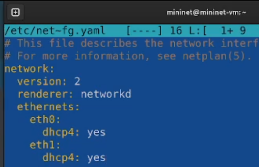
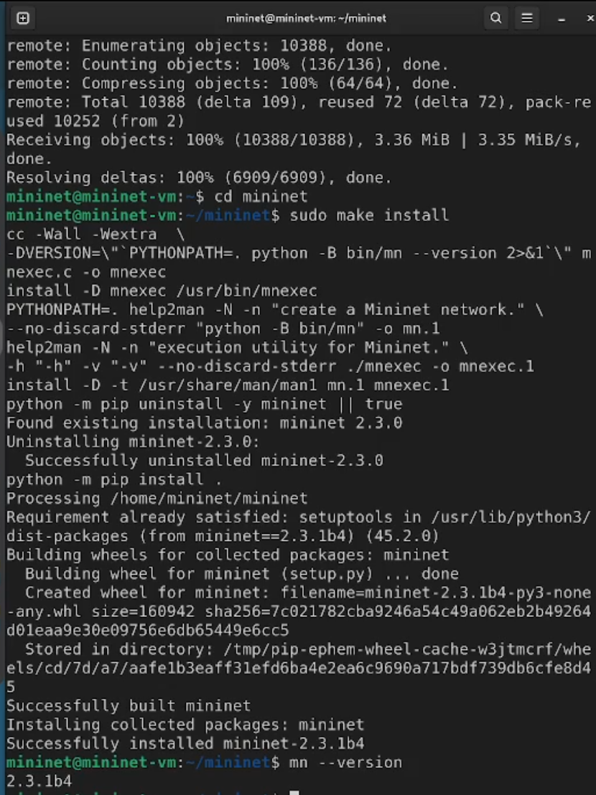
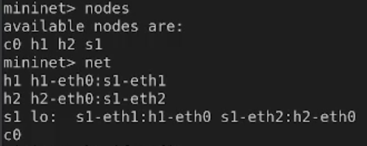
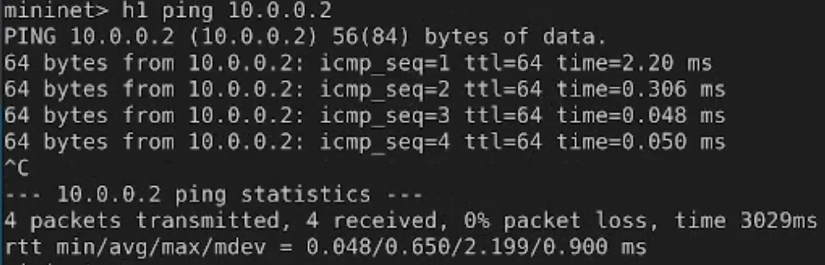
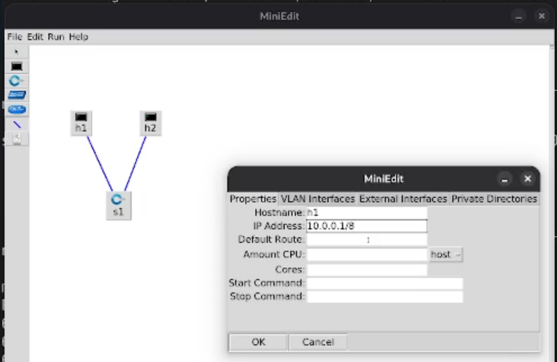
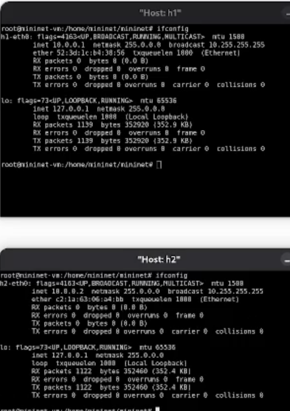
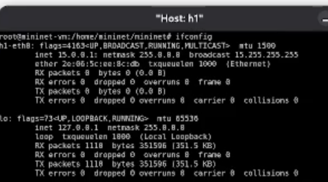
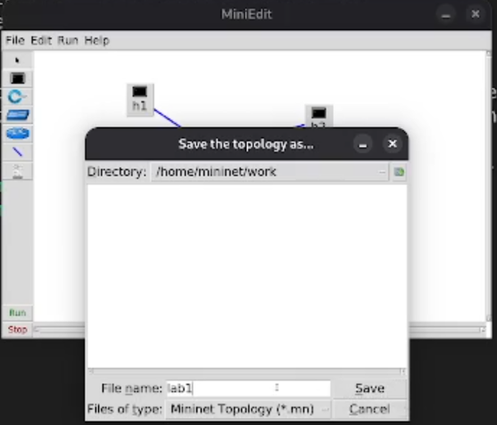

---
## Front matter
lang: ru-RU
title: Лабораторная работа
subtitle: Номер 1
author:
  - Кобзев Д. К. 
institute:
  - Российский университет дружбы народов, Москва, Россия
date: 12 сентября 2026

## i18n babel
babel-lang: russian
babel-otherlangs: english

## Pdf output format
fontsize: 8pt

## Formatting pdf
toc: false
toc-title: Содержание
slide_level: 2
aspectratio: 169
section-titles: true
theme: metropolis
##Fonts
mainfont: Liberation Serif
sansfont: Liberation Sans
monofont: Liberation Mono
---

# Информация

## Докладчик

:::::::::::::: {.columns align=center}
::: {.column width="70%"}

  * Кобзев Дмитрий Константинович
  * Студент
  * Российский университет дружбы народов
  * НПИбд-01-23

:::
::: {.column width="30%"}

:::
::::::::::::::

## Цель работы

Целью данной работы является развёртывание в системе виртуализации mininet, знакомство с основными командами для работы с Mininet через командную строку и через графический интерфейс.

## Настройка образа VirtualBox

Запускаем систему виртуализации и импортируем файл .ovf.
Переходим в настройки системы виртуализации и уточняем параметры настройки виртуальной машины.
Запускаем виртуальную машину с Mininet (Рис. 1.1).

{height=60%}

## Подключение к виртуальной машине

Логинемся в виртуальной машине.
Смотрим адрес машины (Рис. 1.2).

{height=60%}

## Подключение к виртуальной машине

Настраивем ssh-подсоединение по ключу к виртуальной машине.
Подключаемся к виртуальной машине (Рис. 1.3).

{height=60%}

## Настройка доступа к Интернет

Добавляем для mininet указание на использование двух адаптеров при запуске (Рис. 1.4).

{height=60%}

## Обновление версии Mininet

Обновляем версию Mininet (Рис. 1.5).

{height=60%}

## Настройка параметров XTerm

Увеличиваем размер шрифта и применяем векторные шрифты вместо растровых (Рис. 1.6).

{height=60%}

## Настройка соединения X11 для суперпользователя

Настраиваем соединения X11 для суперпользователя (Рис. 1.7).

{height=60%}

## Работа с Mininet с помощью командной строки

Запускаем Mininet с минимальной топологией.
Отображаем доступные узлы.
Отображаем связи между устройствами в Mininet (Рис. 1.8).

{height=60%}

## Работа с Mininet с помощью командной строки

Выполняем команду ifconfig на хосте h1 и h2 и смотрим интерфейсы хостов  (Рис. 1.9).

{height=60%}

## Работа с Mininet с помощью командной строки

Cмотрим интерфейсы коммутатора s1 (Рис. 1.10).

{height=60%}

## Работа с Mininet с помощью командной строки

Проверяем соединение между хостами h1 и h2 (Рис. 1.11).

{height=60%}

## Построение и эмуляция сети в Mininet с использованием графического интерфейса

В терминале виртуальной машины mininet запускаем MiniEdit.
Добавляем два хоста и один коммутатор, соединяем хосты с коммутатором.
Настраиваем IP-адреса на хостах h1 и h2 (Рис. 1.12).

{height=60%}

## Построение и эмуляция сети в Mininet с использованием графического интерфейса

Запускаем эмуляцию.
Смотрим назначенные хостам адреса (Рис. 1.13).

{height=60%}

## Построение и эмуляция сети в Mininet с использованием графического интерфейса

Cмотрим интерфейсы коммутатора (Рис. 1.14).

{height=60%}

## Построение и эмуляция сети в Mininet с использованием графического интерфейса

Настраиваем автоматическое назначение IP-адресов (Рис. 1.15).

{height=60%}

## Построение и эмуляция сети в Mininet с использованием графического интерфейса

Отображаем IP-адреса, назначенные хосту h1 (Рис. 1.16).

{height=60%}

## Построение и эмуляция сети в Mininet с использованием графического интерфейса

Сохраняем топологию Mininet (Рис. 1.17).

{height=60%}

## Выводы

В результате выполнения лабораторной работы мною был развернут в системе виртуализации mininet, знакомлен с основными командами для работы с Mininet через командную строку и через графический интерфейс.
