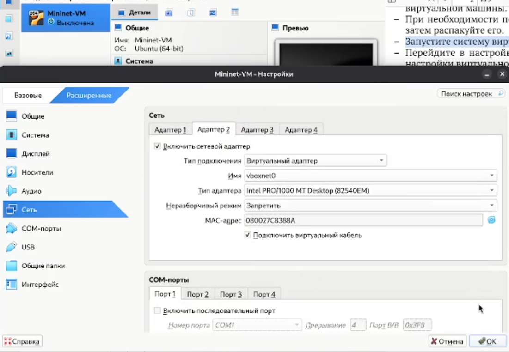
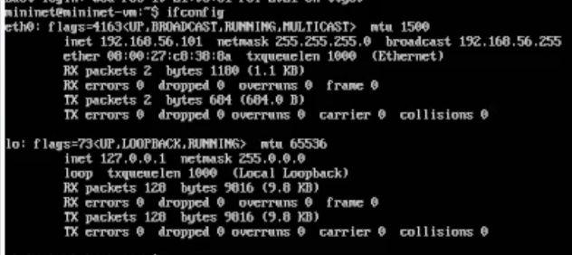
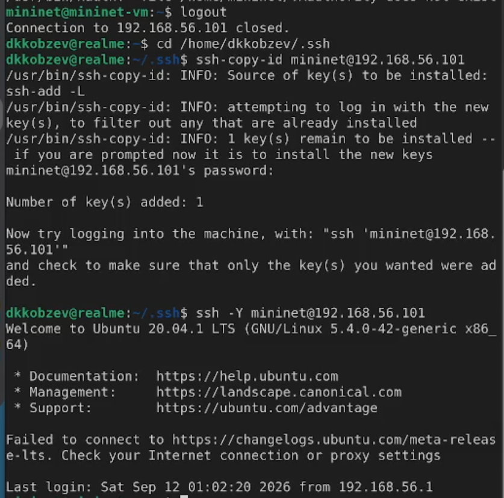
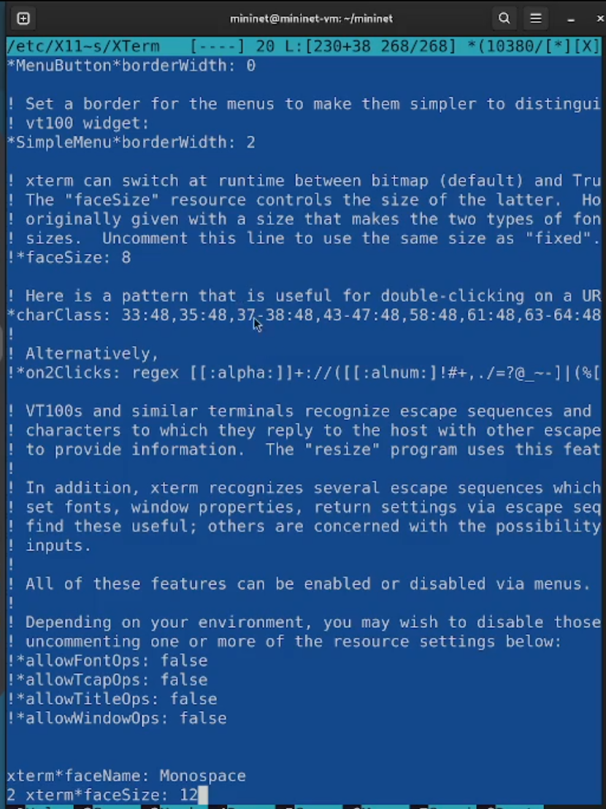
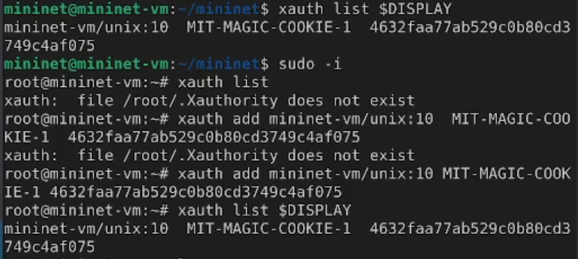
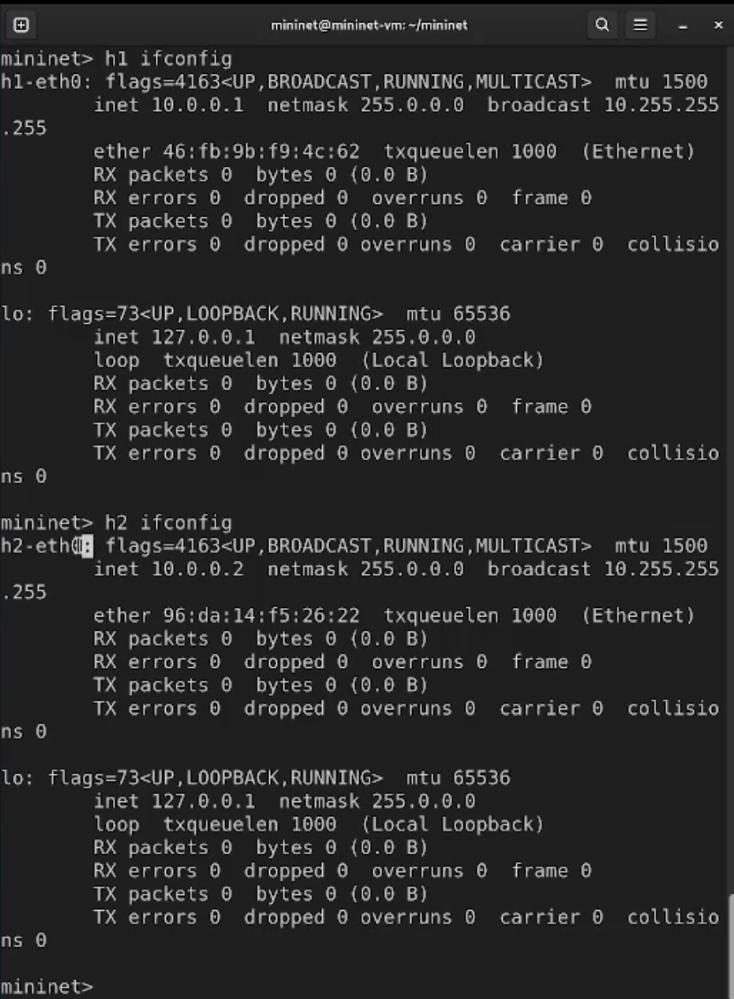
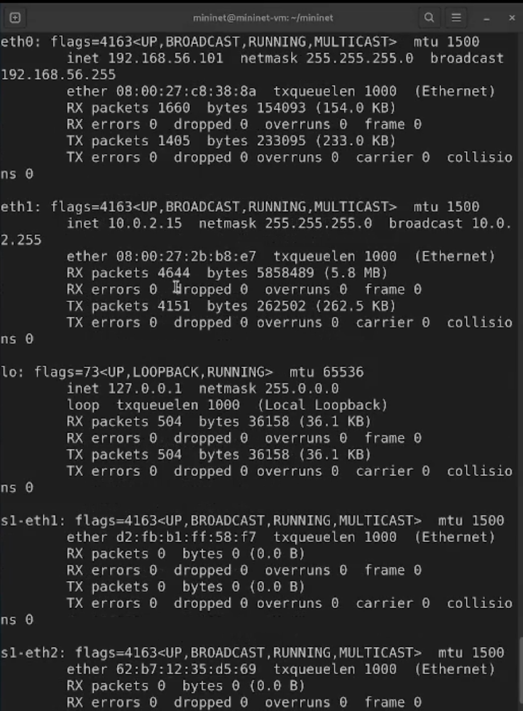
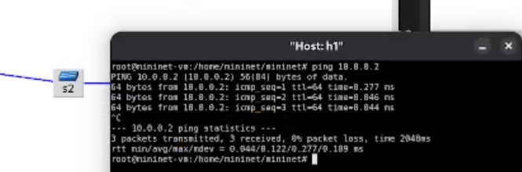
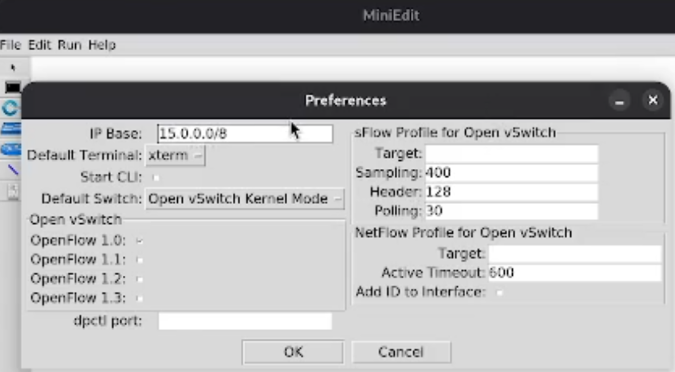

---
## Front matter
title: Лабораторная работа
subtitle: Номер 1
author: "Кобзев Д. К."

## Generic otions
lang: ru-RU
toc-title: "Содержание"

## Bibliography
bibliography: bib/cite.bib
csl: /home/dkkobzev/pandoc/csl/gost-r-7-0-5-2008-numeric.csl

## Pdf output format
toc: true # Table of contents
toc-depth: 2
lof: true # List of figures
lot: true # List of tables
fontsize: 12pt
linestretch: 1.5
papersize: a4
documentclass: scrreprt
## I18n polyglossia
polyglossia-lang:
  name: russian
  options:
    - spelling=modern
    - babelshorthands=true
polyglossia-otherlangs:
  name: english
## I18n babel
babel-lang: russian
babel-otherlangs: english
## Fonts
mainfont: Liberation Serif
romanfont: Liberation Serif
sansfont: Liberation Sans
monofont: Liberation Mono
mainfontoptions: Ligatures=Common,Ligatures=TeX,Scale=0.94
romanfontoptions: Ligatures=Common,Ligatures=TeX,Scale=0.94
sansfontoptions: Ligatures=Common,Ligatures=TeX,Scale=MatchLowercase,Scale=0.94
monofontoptions: Scale=MatchLowercase,Scale=0.94,FakeStretch=0.9

## Pandoc-crossref LaTeX customization
figureTitle: "Рис."
tableTitle: "Таблица"
listingTitle: "Листинг"
lofTitle: "Список иллюстраций"
lotTitle: "Список таблиц"
lolTitle: "Листинги"
## Misc options
indent: true
header-includes:
  - \usepackage{indentfirst}
  - \usepackage{float} # keep figures where there are in the text
  - \floatplacement{figure}{H} # keep figures where there are in the text
---

# Цель работы

Целью данной работы является развёртывание в системе виртуализации mininet, знакомство с основными командами для работы с Mininet через командную строку и через графический интерфейс.

# Выполнение лабораторной работы

Запускаем систему виртуализации и импортируем файл .ovf.
Переходим в настройки системы виртуализации и уточняем параметры настройки виртуальной машины.
Запускаем виртуальную машину с Mininet (Рис. 1.1).

{height=60%}

Логинемся в виртуальной машине.
Смотрим адрес машины (Рис. 1.2).

{height=60%}

Настраивем ssh-подсоединение по ключу к виртуальной машине.
Подключаемся к виртуальной машине (Рис. 1.3).

{height=60%}

Добавляем для mininet указание на использование двух адаптеров при запуске (Рис. 1.4).

{height=60%}

Обновляем версию Mininet (Рис. 1.5).

{height=60%}

Увеличиваем размер шрифта и применяем векторные шрифты вместо растровых (Рис. 1.6).

{height=60%}

Настраиваем соединения X11 для суперпользователя (Рис. 1.7).

{height=60%}

Запускаем Mininet с минимальной топологией.
Отображаем доступные узлы.
Отображаем связи между устройствами в Mininet (Рис. 1.8).

{height=60%}

Выполняем команду ifconfig на хосте h1 и h2 и смотрим интерфейсы хостов  (Рис. 1.9).

{height=60%}

Cмотрим интерфейсы коммутатора (Рис. 1.10).

{height=60%}

Проверяем соединение между хостами h1 и h2 (Рис. 1.11).

{height=60%}

В терминале виртуальной машины mininet запускаем MiniEdit.
Добавляем два хоста и один коммутатор, соединяем хосты с коммутатором.
Настраиваем IP-адреса на хостах h1 и h2 (Рис. 1.12).

{height=60%}

Запускаем эмуляцию.
Смотрим назначенные хостам адреса (Рис. 1.13).

{height=60%}

Cмотрим интерфейсы коммутатора (Рис. 1.14).

{height=60%}

Настраиваем автоматическое назначение IP-адресов (Рис. 1.15).

{height=60%}

Отображаем IP-адреса, назначенные хосту h1 (Рис. 1.16).

{height=60%}

Сохраняем топологию Mininet (Рис. 1.17).

{height=60%}

# Выводы

В результате выполнения лабораторной работы мною был развернут в системе виртуализации mininet, знакомлен с основными командами для работы с Mininet через командную строку и через графический интерфейс.

# Список литературы{.unnumbered}
