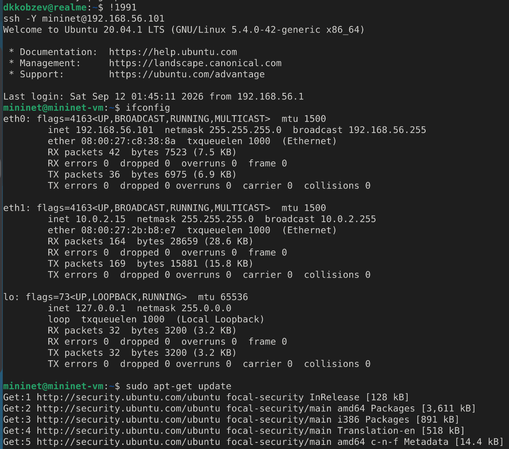
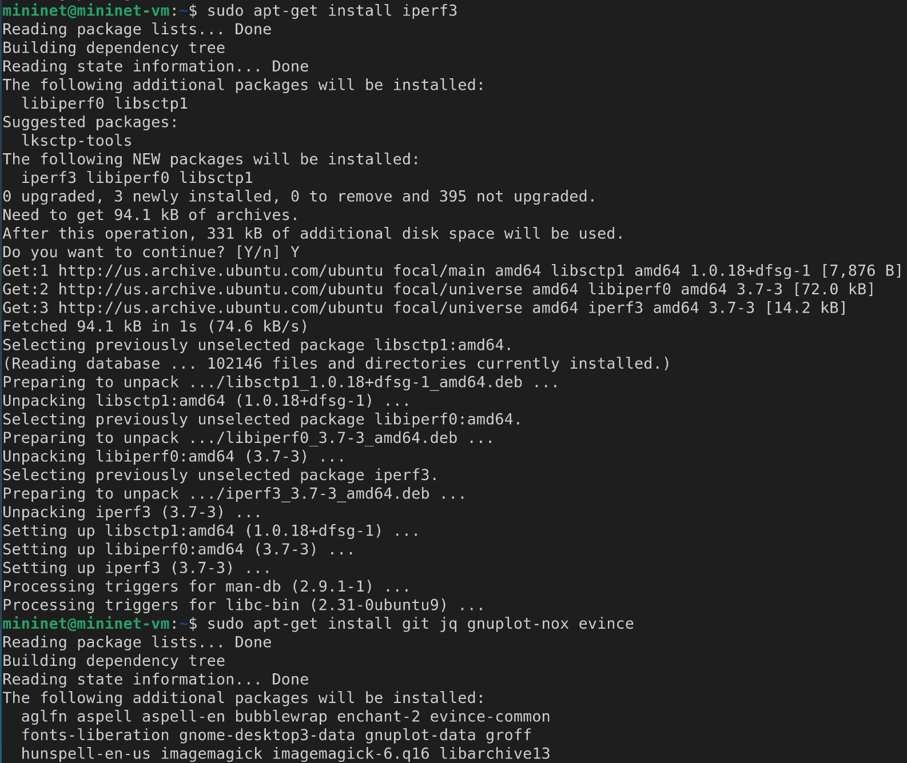
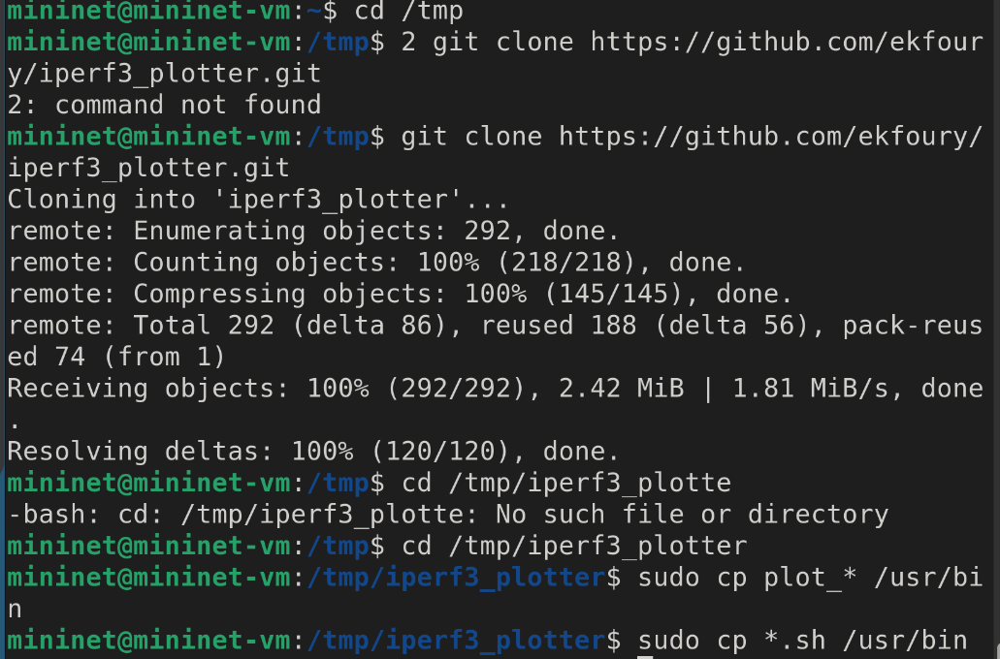
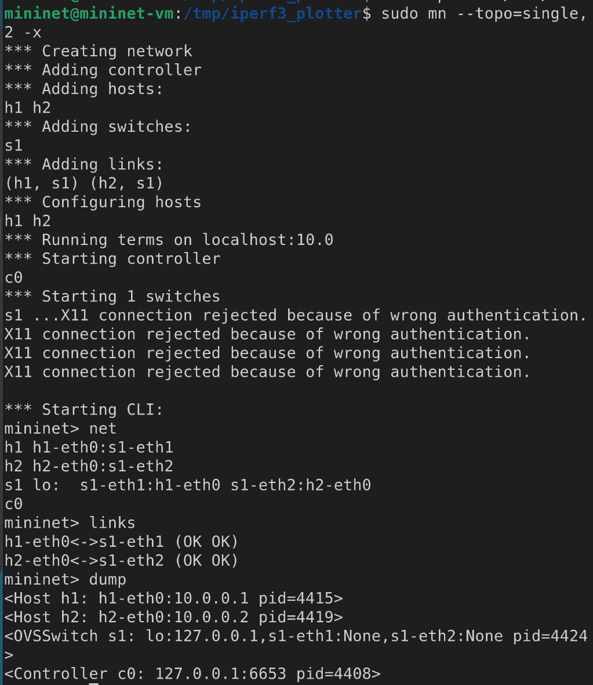
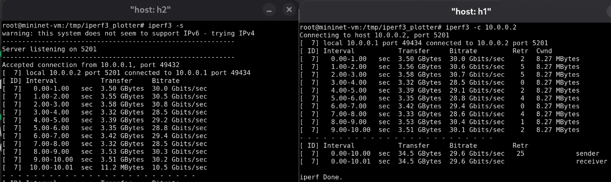
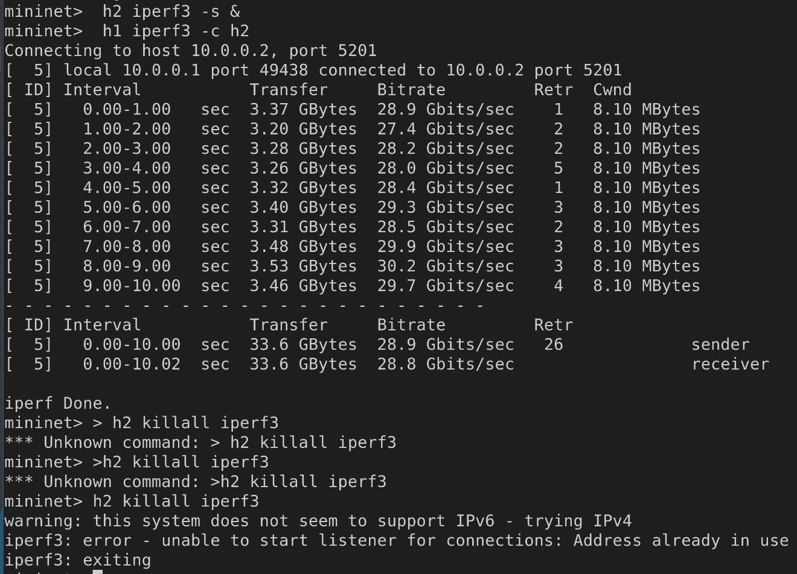
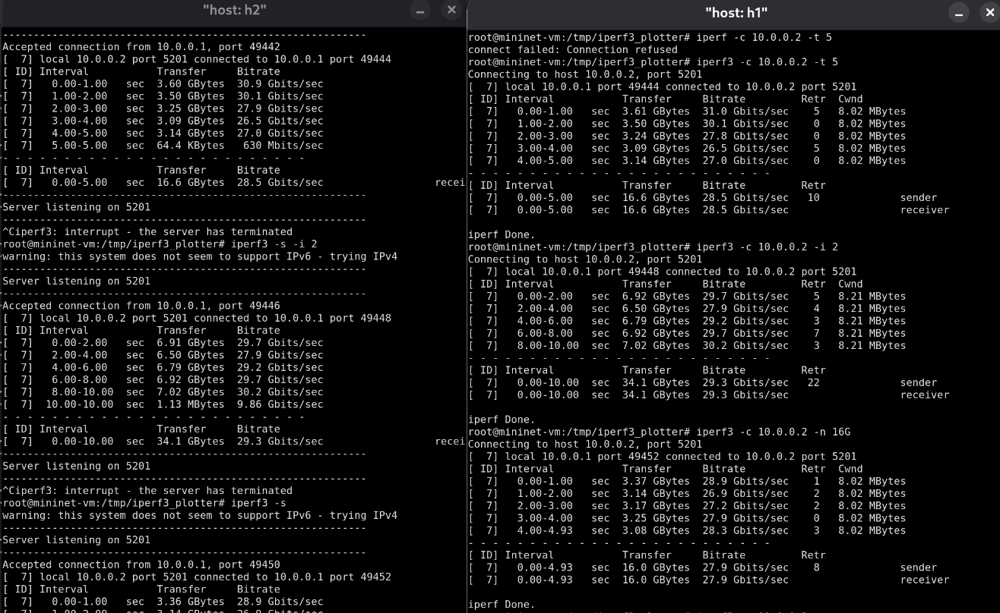
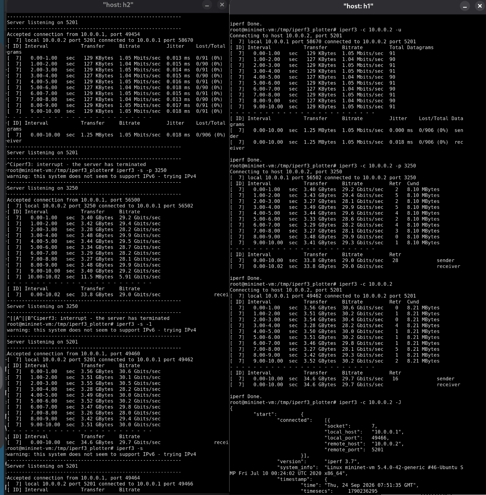
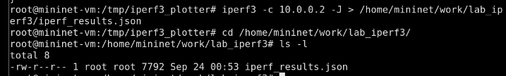
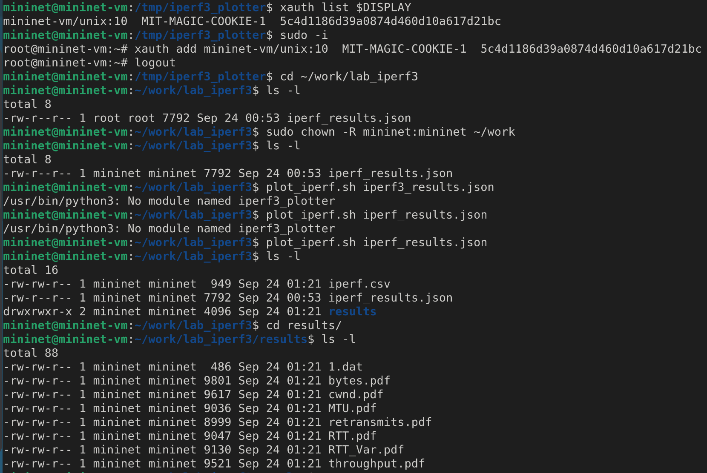

---
## Front matter
lang: ru-RU
title: Лабораторная работа
subtitle: Номер 2
author:
  - Кобзев Д. К. 
institute:
  - Российский университет дружбы народов, Москва, Россия
date: 24 сентября 2026

## i18n babel
babel-lang: russian
babel-otherlangs: english

## Pdf output format
fontsize: 8pt

## Formatting pdf
toc: false
toc-title: Содержание
slide_level: 2
aspectratio: 169
section-titles: true
theme: metropolis
##Fonts
mainfont: Liberation Serif
sansfont: Liberation Sans
monofont: Liberation Mono
---

# Информация

## Докладчик

:::::::::::::: {.columns align=center}
::: {.column width="70%"}

  * Кобзев Дмитрий Константинович
  * Студент
  * Российский университет дружбы народов
  * НПИбд-01-23

:::
::: {.column width="30%"}

:::
::::::::::::::

## Цель работы

Целью данной работы является знакомство с инструментом для измерения пропускной способности сети в режиме реального времени — iPerf3, а также получение навыков проведения интерактивного эксперимента по измерению пропускной способности моделируемой сети в среде Mininet.

## Установка необходимого программного обеспечения

Запускаем виртуальную среду с Mininet.
Из основной ОС подключаемся к виртуальной машине.
После подключения к виртуальной машине mininet смотрим IP-адреса машины.
Обновляем репозитории программного обеспечения на виртуальной машине (Рис. 1.1).

{height=60%}

## Установка необходимого программного обеспечения

Устанавливаем iperf3.
Устанавливаем необходимое дополнительное программное обеспечение на виртуальную машину (Рис. 1.2).

{height=60%}

## Установка необходимого программного обеспечения

Разворачиваем iperf3_plotter. Для этого переходим во временный каталог и скачиваем репозиторий, устанавливаем iperf3_plotter (Рис. 1.3).

{height=60%}

## Интерактивные эксперименты

Задаем простейшую топологию, состоящую из двух хостов и коммутатора с назначенной по умолчанию mininet сетью 10.0.0.0/8.
В терминале виртуальной машины смотрим параметры запущенной в интерактивном режиме топологии (Рис. 1.4).

{height=60%}

## Интерактивные эксперименты

Проводим простейший интерактивный эксперимент по измерению пропускной способности с помощью iPerf3: В терминале h2 запускаем сервер iPerf3, в терминале хоста h1 запускаем клиент iPerf3 (Рис. 1.5).

{height=60%}

## Интерактивные эксперименты

Проведим аналогичный эксперимент в интерфейсе mininet.
Запускаем сервер iPerf3 на хосте h2. Запускаем клиент iPerf3 на хосте h1.
Останавливаем серверный процесс(Рис. 1.6).

{height=60%}

## Интерактивные эксперименты

Для указания iPerf3 периода времени для передачи используем ключ -t.
Настраиваем клиент iPerf3 для выполнения теста пропускной способности с 2-секундным интервалом времени отсчёта как на клиенте, так и на сервере. Используем опцию -i для установки интервала между отсчётами, измеряемого в секундах.
Задаем на клиенте iPerf3 отправку определённого объёма данных. Используем опцию -n для установки количества байт для передачи (Рис. 1.7).

{height=60%}

## Интерактивные эксперименты

Изменяем в тесте измерения пропускной способности iPerf3 протокол передачи данных с TCP на UDP. Для изменения протокола используем опцию -u на стороне клиента iPerf3.
В тесте измерения пропускной способности iPerf3 изменяем номер порта для отправки/получения пакетов или датаграмм через указанный порт. Используем для этого опцию -p. 
В тесте измерения пропускной способности iPerf3 задаем для сервера параметр обработки данных только от одного клиента с остановкой сервера по завершении теста. Для этого используем опцию -1 на сервере iPerf3.
Экспортируем результаты теста измерения пропускной способности iPerf3 в файл JSON (Рис. 1.8).

{height=60%}

## Интерактивные эксперименты

Экспортируем вывод результатов теста в файл, перенаправив стандартный вывод в файл.
Убеждаемся, что файл iperf_results.json создан в указанном каталоге(Рис. 1.9).

{height=60%}

## Интерактивные эксперименты

В виртуальной машине mininet исправляем права запуска X-соединения.
В виртуальной машине mininet переходим в каталог для работы над проектом, проверяем и при корректируем права доступа к файлу JSON.
Генерируем выходные данные для файла JSON iPerf3.
Убеждаемся, что файлы с данными и графиками сформировались (Рис. 1.10).

{height=60%}

## Выводы

В результате выполнения лабораторной работы я был знакомлен с инструментом для измерения пропускной способности сети в режиме реального времени — iPerf3, а также получил навыки проведения интерактивного эксперимента по измерению пропускной способности моделируемой сети в среде Mininet.
